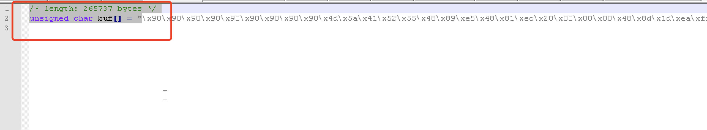
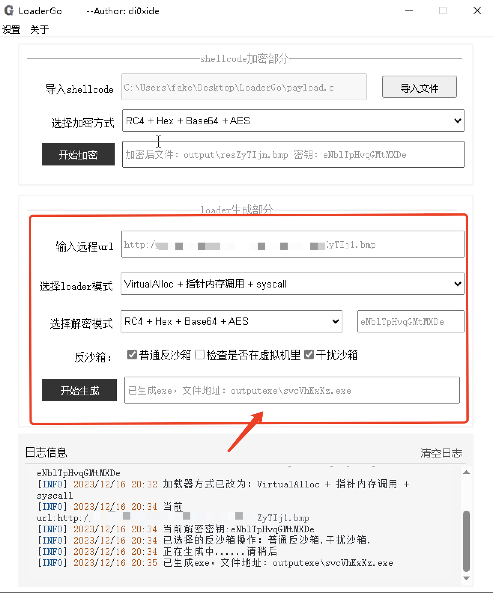
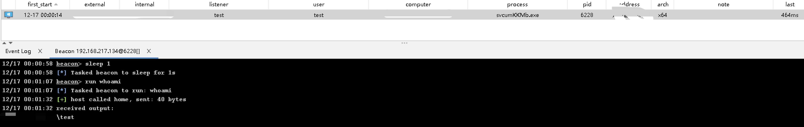

# LoaderGo

LoaderGo-快速生成免杀木马GUI版本，bypass主流杀软

## 开发背景

最近在学习免杀，学了如何使用go来实现shellcode加载器，于是打算写一款gui版本的shellcode加载器。实测过 bypass火绒、金山毒霸、360全家桶、360核晶、wdf、迈克菲等主流杀软

可视化界面参考了wails：https://wails.io/zh-Hans/。 

本LoaderGo只公开了一些基础加载方式，明年开始会陆续更新更多加载方式。但总体来说，使用go来写会遇到各种依赖问题，后续尽量转移到C语言上。

## 注意事项

1. **在此声明，未经授权不要拿去做违法事情，若出任何事情与本人无关。**
2. 不用传到微步之类的沙箱，LoaderGo运行环境最好断网，不要被上传样本导致木马很快被杀。

## 环境准备

虽然LoaderGo程序本身已经通过Go编译好了，但是在生成exe的时候，还是需要go环境，因此运行环境需要有go1.20版本。

环境准备：Go和git，Go：1.20.x版本

https://go.dev/dl/go1.20.12.windows-amd64.msi 下载安装go

如果环境内有多个版本Go，可以使用g:https://github.com/voidint/g来进行管理，亲测好用

https://git-scm.com/download/win 安装git

https://github.com/git-for-windows/git/releases/download/v2.43.0.windows.1/Git-2.43.0-64-bit.exe

打开LoaderGo的时候可能会提示没有webview组件，正常安装即可。

## 使用方法

### 初始化

打开我们的工具，这里提示我们没有依赖

点击菜单安装依赖，或者点击目录下的安装依赖.bat都可以。

这里要注意，依赖是基于Go1.20版本的，所以本机环境必须是1.20的go。

依赖安装完毕

如果这里点击以后，界面卡住的话，请手动点击依赖.bat

根据提示再次初始化

初始化成功后，就可以开始生成shellcode了，这里可以点击清除日志，让界面干净一些。

### 生成shellcode

使用cs生成payload

这里选择C

删除多余的信息，只留\x00\x11\x99…….这些字符

### 加密

LoaderGo采取的是远程分离加载，我们先对原生shellcode进行加密。

导入shellcode，选择加密方式，这里只写了一种，所以不用选择，直接生成即可。

将生成的文件放在云上或者vps上，为了隐匿，推荐使用oss。

这里我放到了云端上，接下来就是生成exe了

### 生成木马

把刚才云端的地址，填到这里

选择想要的加载方式和解密模式，这里因为只有一种加密所以这里不用选别的。然后填上前一步生成的密钥

然后选择反沙箱模式，一般情况下选择1和3就可以，选2的话将在虚拟机里无法执行。然后点击生成即可。等待约30s即可生成到指定目录。

## 免杀效果

### 360全家桶

四种加载方式都可以上线

开启所有引擎

线程注入也可以成功上线

### 金山毒霸+火绒

### wdf

### 卡巴斯基

前两种会被直接删除，线程注入的可以正常上线，但是躲不过内存扫描（后续继续完善）

### 迈克菲

